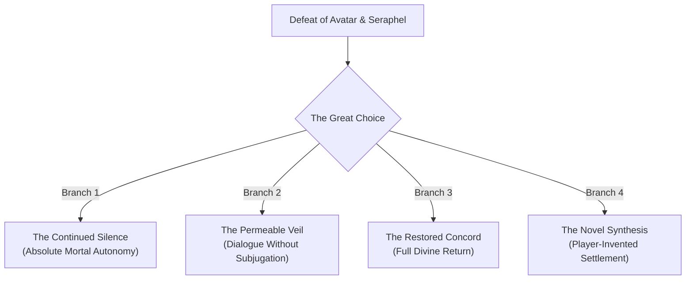

# Full Story Synopsis: Ashes of Elonia

> *"History was buried. The dead are missing. The future is blank."*  
> **Dungeon Master Confidential • Spoiler-Complete Beginning-to-End Narrative**

---

## 1. The Mythic Antiquity (Before 0 AS)

### 1.1 The Awakening and Discovery `[ESTABLISHED CANON]` `[UNRESOLVED]`
In an age unmeasured by mortal reckoning, the Nine Celestine awakened into the material cosmos from the **Sea Beyond**—a primordial state of boundless potential rather than a physical ocean. Why the Nine awakened, whether a conscious will summoned them, and the ultimate nature of the Sea Beyond remain protected unknowns `[UNRESOLVED]`. 

The Celestine did not create the world, nor did they author humanity. Upon entering Elonia, they discovered mortals already wandering its wilderness. Humanity fascinated the gods: unlike divine entities, who were locked into immutable metaphysical principles, humans were morally fluid, capable of contradicting their nature, defying their own convictions, and transforming their destiny. Orinth, the Laughing Sage, was the first to open his eyes; Myrraen, the Last Mercy, was the last.

### 1.2 The First Covenant and the Nine Cities (c. 3,500–1,600 BS) `[ESTABLISHED CANON]`
At the founding of the **First Covenant**, the gods offered mortals partnership rather than subjugation. In exchange for mortal reverence, the Celestine provided shelter, agriculture, deep magic, and philosophical guidance. Nine great metropolitan civilizations arose, each reflecting the divine patron who nurtured it:
- Solcaris under Aurelion (Justice and Solar Law)
- Ilyanor under Orinth (Wisdom, Arcana, and Invention)
- Vareth-Tor under Varek (Funerary Rites, Remembrance, and Passage)
- Nythara under Selyra (Prophecy and Astronomy)
- Vale Myrr under Myrraen (Healing, Mercy, and Sanctuary)

For nearly two millennia, Elonia flourished in golden prosperity. Miracles were common; death was dignified; poverty was eradicated under divine benevolence.

### 1.3 The Atrocities of Avarr: The Crisis of Certainty (c. 1,600 BS) `[ESTABLISHED CANON]` `[DM-ONLY]`
The golden age shattered not through demonic invasion or mortal rebellion, but through **benevolent conviction**. In the city of **Avarr**, mortals dedicated to absolute purity, divine order, and moral perfection grew intolerant of human errancy. Convinced that they were fulfilling the divine mandate of the Covenant, the leaders of Avarr enacted systematic cultural purges, forced behavioral alterations, and generational executions to eradicate "sin" and "imperfection."

When the Celestine descended to shatter Avarr and end the horrors, the revelation devastated Myrraen. The people of Avarr had committed atrocities not out of malice, but out of total certainty that their divine protectors approved their crusade. Myrraen realized a terrifying paradox: **unquestioned divine protection creates moral infancy**, stripping mortals of the capacity to understand real consequence.

### 1.4 The Ascensionists and the Ascension Engine (c. 1,200–950 BS) `[ESTABLISHED CANON]` `[DM-ONLY]`
Following Avarr, a faction of mortal philosophers, arcanists, and civic architects known as the **Ascensionists** arose. Contrary to modern propaganda, they were not a profane death cult; they were enlightened humanists and reformers. They argued that humanity must learn to stand on its own feet, cure its own diseases, and conquer mortality without relying perpetually on divine indulgence.

Their supreme masterpiece was the **Ascension Engine**, constructed miles beneath the earth in the abyssal subterranean vaults of what is now called the **Engine Deep**. The Engine was conceived as a metaphysical scaffold to weave mortal souls into an eternal, self-sustaining loop—effectively eliminating death and granting mortality independent immortality.

The experiment failed catastrophically. In attempting to seize authority over life and death, the Engine overloaded. Millions of souls were wrenched, shattered, and trapped; the subtle, ancient metaphysical pathways through which souls journey to the final passage—the **soulways**—were violently fractured. Varek, Keeper of the Final Door, intervened to halt the disaster, but the spiritual fabric of Elonia was left permanently scarred.

### 1.5 The Last Council and the Great Silence (901–0 BS / 0 AS) `[ESTABLISHED CANON]` `[DM-ONLY]`
The disaster of the Engine forced the Celestine to convene the **Last Council**. The pantheon fractured:
- **Aurelion** argued for tighter authority and direct martial governance over mortals.
- **Thaeron** and **Iskara** demanded that mortals bear the full bloody cost of their actions.
- **Selyra** looked into the future and wept, observing timelines where mortal dependence led to total spiritual atrophy.
- **Myrraen**, carrying the profound burden of compassion, concluded that the gods themselves were the cage. As long as the Celestine remained visible, mortals would never grow, never accept responsibility, and never mature into sovereign beings.

In the fateful year **0 AS**, Myrraen enacted the **Silence**. Channeling her immense divine authority, she severed the tether binding the Celestine to the material plane, erecting the metaphysical boundary known as the **Veil**. The gods were drawn beyond, leaving humanity in sudden, deafening quiet. 

Unknown to the other gods and mortals alike, **Orinth refused to depart**. Stripping himself of his divine splendor, the Laughing Sage stayed behind as a humble, mortal-passing witness, determined to watch humanity's journey without ever intervening as a ruler or answering their questions.

---

## 2. The Modern Era (c. 1,000 AS)

### 2.1 The World Rebuilt `[PLAYER-FACING]`
For three centuries after 0 AS (the *Age of Ashes*), Elonia suffered starvation, war, and societal collapse as miracle-dependent infrastructure failed. Yet mortals survived. They engineered aqueducts, synthesized medicines, codified secular law, and developed industrial-scale arcana. By 1,000 AS, five great sovereign realms dominate the continent:
- **The Aurelian League:** Civic order, professional legions, and bureaucratic justice.
- **The Republic of Ilya:** Maritime trade, universities, and competitive magical research.
- **The Dominion of Vareth:** Ancient funerary culture, ancestral memory, and meticulous mortal necrology.
- **The Verdancy:** Decentralized forest communes honoring ecological equilibrium.
- **The Free Coast:** Mercantile ports, privateer flotillas, and fierce self-determination.

### 2.2 The Brewing Soul Crisis `[ESTABLISHED CANON]` `[DM-ONLY]`
Beneath this flourishing renaissance, the ancient wound of the Ascension Engine has festered for ten centuries. The damaged soulways have reached a breaking point. In the Dominion of Vareth, mortuary scribes note a terrifying anomaly: **the dead are not departing**. Spirits linger as restless echoes; corpses refuse quiet decomposition; ancestral vaults hum with unpassed psychic agony. 

Commoners whisper of ghosts and divine wrath, but the academic elite and magistrates systematically censor the reports to prevent continent-wide panic.

### 2.3 Seraphel: The Hidden Tenth `[DM-ONLY]`
Into this crisis steps **Lord Seraphel of House Vane**. Publicly, Seraphel is the Republic of Ilya's most celebrated philanthropist, antiquarian, and leading patron of the **Ascendants** (a popular, pluralistic scholarly movement excavating Pre-Silence ruins). He is charming, deeply compassionate, intellectually brilliant, and a generous sponsor of researchers and adventurers.

Privately, Seraphel is a monster of supreme intellect and unyielding certainty. Decades ago, Seraphel discovered the true cause of the Soul Crisis: the surviving conduits of the Ascension Engine. While investigating the wound, he arrived at a breathtaking conclusion: the gods were cowards who fled their responsibilities, and humanity is doomed by its own fragility unless someone ascends to take command.

Seraphel does **not** seek to summon the ancient gods back to Elonia. Instead, he has engineered a colossal deception. Using "divine return" rhetoric as public cover, Seraphel plans to use the millions of trapped, unpassed souls within the damaged soulways as raw metaphysical fuel. By activating the dormant nodes of the Ascension Engine across Elonia, he intends to force open the Veil and absorb that vast spiritual power into himself—ascending as **the Tenth Celestine**, the sole living god of Elonia.

---

## 3. The Campaign Spine: Acts I through VI

```
┌──────────────────────────────────────────────────────────────────────────┐
│                   THE ARCHITECTURAL SPINE (ACTS I - VI)                  │
├───────┬────────────┬─────────────────────────────┬───────────────────────┤
│ Act   │ Level Band │ Player-Facing Trajectory    │ Required Turn / Shock │
├───────┼────────────┼─────────────────────────────┼───────────────────────┤
│ Act I │ Lv 1–4     │ Archaeological Salvage      │ The Ascensionists were│
│       │            │ in Port Meridian            │ reformers, not demons │
├───────┼────────────┼─────────────────────────────┼───────────────────────┤
│ Act II│ Lv 4–8     │ Academic Investigation      │ History was censored  │
│       │            │ in New Ilya                 │ by state institutions │
├───────┼────────────┼─────────────────────────────┼───────────────────────┤
│ Act III Lv 8–12    │ Divine Relic Hunt at        │ Brother Cael is       │
│       │            │ Lantern Chapel              │ Orinth in disguise    │
├───────┼────────────┼─────────────────────────────┼───────────────────────┤
│ Act IV│ Lv 12–15   │ Metaphysical Inquiry in     │ Soul Crisis is real,  │
│       │            │ Khar Vareth / Bleak Path    │ and being exploited   │
├───────┼────────────┼─────────────────────────────┼───────────────────────┤
│ Act V │ Lv 15–18   │ Continental Race Against    │ Seraphel seeks his own│
│       │            │ the "Divine Return"         │ personal apotheosis   │
├───────┼────────────┼─────────────────────────────┼───────────────────────┤
│ Act VI│ Lv 18–20   │ Descent into Engine Deep &  │ Defeat certainty;     │
│       │            │ Breach at the Open Veil     │ write the blank future│
└───────┴────────────┴─────────────────────────────┴───────────────────────┘
```

### Act I: Embers Beneath the Ashes (Levels 1–4)
- **Setting:** The bustling trade metropolis of Port Meridian.
- **Action:** Hired by salvage factor **Helena Voss** and scholar **Arlen Marr**, the characters delve beneath the city's warehouse district into the sunken Pre-Silence ruins known as the **Shattered Archive**.
- **The Turn:** Players expect to fight depraved cultists. Instead, primary archival evidence reveals that the ancient Ascensionists were legitimate mortal philosophers, engineers, and civic leaders. Furthermore, they discover fresh bootprints and newly tampered wards—proving that someone in the modern era has been excavating these forbidden vaults recently.
- **Seraphel's Entrance:** Seraphel appears as a benevolent saviour and sponsor, bailing the party out of municipal scrutiny, validating their scholarly discoveries, and awarding them research grants to continue their work in New Ilya.

### Act II: The Forgotten Age (Levels 4–8)
- **Setting:** New Ilya, the university capital of Elonia.
- **Action:** The party infiltrates elite scholarly circles, attends symposiums, and delves into the forbidden, sealed subterranean stacks of the **Athenaeum Null**.
- **The Turn:** The party discovers that the historical narrative of the Silence taught across the continent is a deliberate lie. Records were systematically expunged not by evil conspirators, but by modern academic cartels and League magistrates to suppress panic over the damaged soulways. They unearth the first references to the catastrophic **Ascension Engine**.
- **Escalation:** Seraphel acts as their intellectual confidant, cautioning them against reactionary magistrates while subtly steering them toward ancient covenant sites across the continent.

### Act III: The Last Light (Levels 8–12)
- **Setting:** The misty, isolated crags of the Weeping Ridge and the secluded **Lantern Chapel**.
- **Action:** Seeking the *Lantern of the Last Light* to authenticate ancient covenant seals, the party resides at the chapel, hosted by its eccentric, tea-brewing elderly caretaker, **Brother Cael**.
- **The Turn:** Through impossible chronological inconsistencies in Cael's journals and an encounter with an ancient relic that only a Celestine can attune, the party deduces the staggering truth: **Brother Cael is Orinth, the Laughing Sage**. 
- **The Divine Revelation:** Orinth does not provide a magical quest-marker. He confesses that he stayed behind as a witness. He reveals the true horror of Avarr and Myrraen's heartbreaking motive for enacting the Silence: divine shelter had become an intolerable cage. He warns them that the dead are screaming beneath the earth, and directs them to Khar Vareth.

### Act IV: The Missing Dead (Levels 12–15)
- **Setting:** Khar Vareth, the monumental necropolis city, and the metaphysical transit expanse known as **The Bleak Path**.
- **Action:** Working with the Vareth Custodians, the party investigates the breakdown of funerary rites and crosses into the borderlands of death.
- **The Turn:** The Soul Crisis is horrifyingly real. Millions of souls are trapped in agonized stasis within the broken soulways. But more critically, the party discovers **modern brass conduits and arcane siphon-arrays** spliced directly into the ancient wounds of the Ascension Engine.
- **The Unmasking:** Tracing the arcane serial numbers and alloy metallurgical signatures of the siphon-arrays, the evidence points incontrovertibly to one source: **House Vane and Lord Seraphel**. Seraphel is not just studying the crisis—he is actively harvesting the lost dead.

### Act V: The Returners (Levels 15–18)
- **Setting:** Across Elonia—from the ruined observatory of Nythara to the subterranean Star Roads.
- **Action:** The continent erupts into religious hysteria. Fronting a faction called the "Returners," Seraphel publicly declares that the Nine Celestine are awakening and that a great convergence ritual will open the Veil and restore the golden age. Crowds flock to his banner; city magistrates surrender authority to his delegates.
- **The Turn:** The party discovers the mathematical geometry of Seraphel's ritual. It is not an invocation to summon the Nine; it is an inversion designed to devour them and channel the harvested soul-reservoir into Seraphel's flesh. He intends to become the **Hidden Tenth**—an all-powerful mortal god who will force absolute peace and obedience upon humanity.
- **The Climax of Chase:** The party races through the Star Roads, dismantling Seraphel's regional soul-pylons, fighting his fanatic inner circle, and descending into the abyssal roots of the world: **The Engine Deep**.

### Act VI: The Last Mercy (Levels 18–20)
- **Setting:** The Engine Deep and the metaphysical boundary of **The Open Veil**.
- **The Confrontation:** The party penetrates the subterranean core of the ancient Ascension Engine, battling through warped spatial geometries and temporal distortions to confront Seraphel atop the Apotheosis Dais.
- **The Dual Climax:**
  1. *Stopping the Tenth:* The party battles Seraphel as he channels the raw spiritual current of millions of unpassed souls. Defeating him requires severing his conduits and releasing the stolen spirits without destroying the fragile material fabric of the chamber.
  2. *The Avatar of the Last Mercy:* As the Veil tears under the strain of the interrupted ritual, the divine current coalesces into a catastrophic metaphysical entity: the **Avatar of the Last Mercy**. The Avatar is not evil; it is **protective certainty made manifest**. Seeing mortal suffering and the horror of the Engine, it seeks to envelop Elonia in an eternal, painless, stasis-sleep where no mortal can ever make a choice, feel grief, or suffer again.
- **The Ultimate Test:** The party must overcome the Avatar—not by rejecting compassion, but by championing the right of mortals to risk pain, bear consequence, and choose their own destiny.

---

## 4. The Unwritten Future: Endgame Branches `[DM-ONLY]`

`[ESTABLISHED CANON]`
Following the defeat of the Avatar and the stabilization of the soulways, the party stands before the shimmering boundary of the Veil, holding the surviving relics of the covenant and the ancient codex *Ain Elonar*. **The final chapter, "Of What Comes Next," lies open and blank.**

No ending is pre-ordained. The players must deliberate and choose the future of Elonia:



### Branch 1: The Continued Silence (Permanent Severance)
- The party completely seals the Veil, repairing the soulways through mortal arcanotechnology and permanently locking the gods beyond the material world.
- **Consequence:** Humanity is entirely on its own. Divine magic becomes purely ancestral and internal. Mortals bear full, unguided responsibility for their wars, sciences, and moral triumphs.

### Branch 2: The Permeable Veil (The Open Conversation)
- The party establishes a balanced, porous threshold. The gods remain beyond the Veil, but communication, philosophy, and occasional dialogue are re-established without direct divine intervention or rulership.
- **Consequence:** A mature partnership. The gods advise and converse, but cannot enforce their decrees with lightning or absolute miracles. Humanity retains its sovereignty.

### Branch 3: The Restored Concord (The Divine Return)
- The party brings down the Veil, welcoming the surviving Celestine back into the material plane to rebuild the ruined shrines and guide mortal civilization once more.
- **Consequence:** Famine, disease, and the Soul Crisis are instantly healed by divine grace. Yet the ancient dilemmas of Avarr re-emerge: will mortals surrender their hard-won self-reliance, sliding back into moral infancy under divine shelter?

### Branch 4: The Novel Synthesis (Player Authorship)
- The party constructs a unique metaphysical arrangement derived from their specific journey, allegiances, and discoveries throughout the campaign.
- **Consequence:** Authentic emergent storytelling. The players dictate the words written into the final chapter of *Ain Elonar*, cementing their legacy into the cosmology of Elonia forever.
