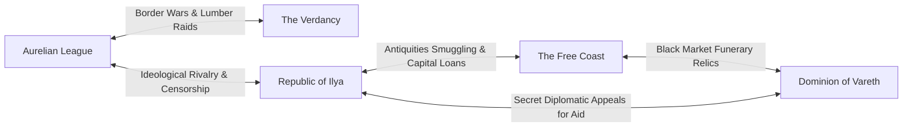

# Nations and Powers: The Geopolitics of Modern Elonia

> *"A millennium after the gods departed, mortals built their own thrones from the rubble."*  
> **World Architecture • Modern Geopolitics (c. 1,000 AS)**

---

## 1. Geopolitical Landscape Overview `[ESTABLISHED CANON]`

In **c. 1,000 AS**, the continent of Elonia is balanced among **Five Great Powers**. Following the devastation of the three-century *Age of Ashes*, these sovereign nations emerged not from divine decree, but through mortal resilience, commercial expansion, and regional ideology. While an uneasy peace—the **Concord of Meridian**—prevents continental war, cold-war espionage, trade tariffs, and covert competition over Pre-Silence antiquities are fierce.

---

## 2. The Five Great Powers

---

### 2.1 The Aurelian League
*The Bastion of Law, The Solar Hegemony*
- **Capital:** **Solcaris Nova** (Built adjacent to the ruins of ancient Solcaris)
- **Government:** A constitutional martial republic governed by the **Senate of Archons** and the **Lord Protector**.
- **Cultural Identity:** `[PLAYER-FACING]` Honor, duty, civic sacrifice, and codified law. The League views itself as the sole legitimate heir to the civil order established by Aurelion. Its cities feature gleaming white stone plazas, triumphal arches, and flawless paved roads.
- **Military:** The **Aurelian Legions**, the continent's most disciplined heavy infantry, supported by the **Knights of the Solar Aegis** and battlefield abjurers.
- **Stance on Antiquities & Religion:** Extremely conservative. The League operates the **Prefecture of Antiquities**, which confiscates unapproved Pre-Silence artifacts. They sponsor the *Keepers of Dawn*, preaching that if humanity maintains perfect civic righteousness, the golden age of divine harmony will return.
- **Internal Vulnerability:** `[DM-ONLY]` Rigid legalism masks growing social inequality. Reformist factions within the Senate secretly collaborate with the Ascendants to challenge the military aristocracy.

---

### 2.2 The Republic of Ilya
*The Sovereign Academies, The City of Questions*
- **Capital:** **New Ilya** (Built over the ancient university-spires of Ilyanor)
- **Government:** A meritocratic magocracy governed by the **Council of Deans** (heads of the Grand Lyceum’s eight faculties) and the **Consul of Commerce**.
- **Cultural Identity:** `[PLAYER-FACING]` Knowledge, debate, free inquiry, and cutting-edge arcane engineering. In Ilya, social standing is determined by academic degrees, published treatises, and patent ownership. Its riverfront canals are crowded with floating lecture halls and alchemical laboratories.
- **Military:** The **Magisterial Guard**, supported by arcane skyships, golem-automatons, and mercenary battalions hired from the Free Coast.
- **Stance on Antiquities & Religion:** Champion of secular progress. The Republic officially views the Silence as humanity's liberation from divine coddling.
- **The Secret Shame:** `[DM-ONLY]` While publicly preaching freedom of inquiry, the Council of Deans operates the **Athenaeum Null**—an elite, black-budget censorship division that ruthlessly scrubs records of the Ascension Engine to prevent panic over the failing soulways. House Vane (led by Lord Seraphel) holds massive financial sway over the Republic's senate.

---

### 2.3 The Dominion of Vareth
*The Silent Realm, The Keepers of the Names*
- **Capital:** **Khar Vareth** (The Great Basalt Necropolis)
- **Government:** A solemn bureaucratic theocracy governed by the **Conclave of Custodians** and the **High Scribe of the Dead**.
- **Cultural Identity:** `[PLAYER-FACING]` Ancestral veneration, memory, architecture of stone, and mortal dignity. In Vareth, the living consider themselves merely temporary caretakers for the dead. Every citizen’s lineage, virtues, and debts are engraved onto monumental stone tablets within the family vaults.
- **Military:** The **Scythe of Vareth** (disciplined halberdiers) and **Grave-Wardens** specialized in abjuration and protective necromancy.
- **Stance on Antiquities & Religion:** Deeply reverent toward Varek, Keeper of the Final Door. They do not seek to resurrect the dead, but to protect their final rest.
- **The Boiling Crisis:** `[DM-ONLY]` The Dominion is ground zero for the **Soul Crisis**. For three centuries, their mortuary scribes have documented an exponential failure in the soulways. Their catacombs are overcrowded with restless, screaming spirits, forcing the High Custodians to quietly seek outside help while trying to prevent mass terror.

---

### 2.4 The Verdancy
*The Forest Moot, The Living Canopy*
- **Capital:** **The Living Spires of Elynor**
- **Government:** A decentralized ecological confederation governed by the **Grand Moot of Grovewardens** and regional druidic circles.
- **Cultural Identity:** `[PLAYER-FACING]` Natural harmony, cyclical seasons, agrarian communes, and suspicion of industrial cities. Citizens live in giant ironwood arboreal villages, harvesting alchemical herbs and practicing non-invasive forestry.
- **Military:** Guerrilla **Canopy Rangers**, beast-tamers, and Circle druids capable of commanding living flora and insect swarms.
- **Stance on Antiquities & Religion:** Views all arcane machinery (especially Pre-Silence contraptions) as blasphemous poisons that disrupt natural cycles. They reject the worship of the Celestine, honoring Elyndra only as the cycle of growth and decay.
- **Flashpoint:** Hostile border disputes with the Aurelian League, whose lumber syndicates repeatedly encroach upon the sacred southern groves.

---

### 2.5 The Free Coast
*The Guilded Ports, The Haven of the Open Horizon*
- **Principal Metropolis:** **Port Meridian**
- **Government:** An oligarchic maritime league governed by the **High Admiralty Council** and the **Merchant Guilds**.
- **Cultural Identity:** `[PLAYER-FACING]` Unfettered trade, personal reinvention, privateering, and absolute freedom of movement. If you have gold and a seaworthy hull, no magistrate will ask your origin or religion. Port Meridian is a dizzying swirl of sailors, scholars, smugglers, and fortune-seekers.
- **Military:** Massive naval armada of armed merchantmen, privateers, and elite sellsword companies (e.g., *The Iron Compass*).
- **Stance on Antiquities & Religion:** Purely commercial. Pre-Silence ruins beneath their docks are treated as corporate salvage assets. They harbor the most active branches of both the **Ascendants** and the black-market **Archive Cartels**.

---

## 3. Flashpoints & Cold Wars (c. 1,000 AS)

1. **The Antiquities Smuggling Corridor:** Illicit artifacts excavated beneath Port Meridian are regularly smuggled up the River Ilya into New Ilya's black auctions, drawing armed raids from Aurelian League inquisitors.
2. **The Meridian Trade Tariffs:** The Republic of Ilya and Aurelian League threaten naval blockades against Free Coast ports over predatory maritime tariffs.
3. **The Vareth Quarantine Threat:** If the Dominion of Vareth cannot conceal its spiritual haunting crisis, the Aurelian League has prepared contingency plans to erect a military quarantine line along the southern passes.
