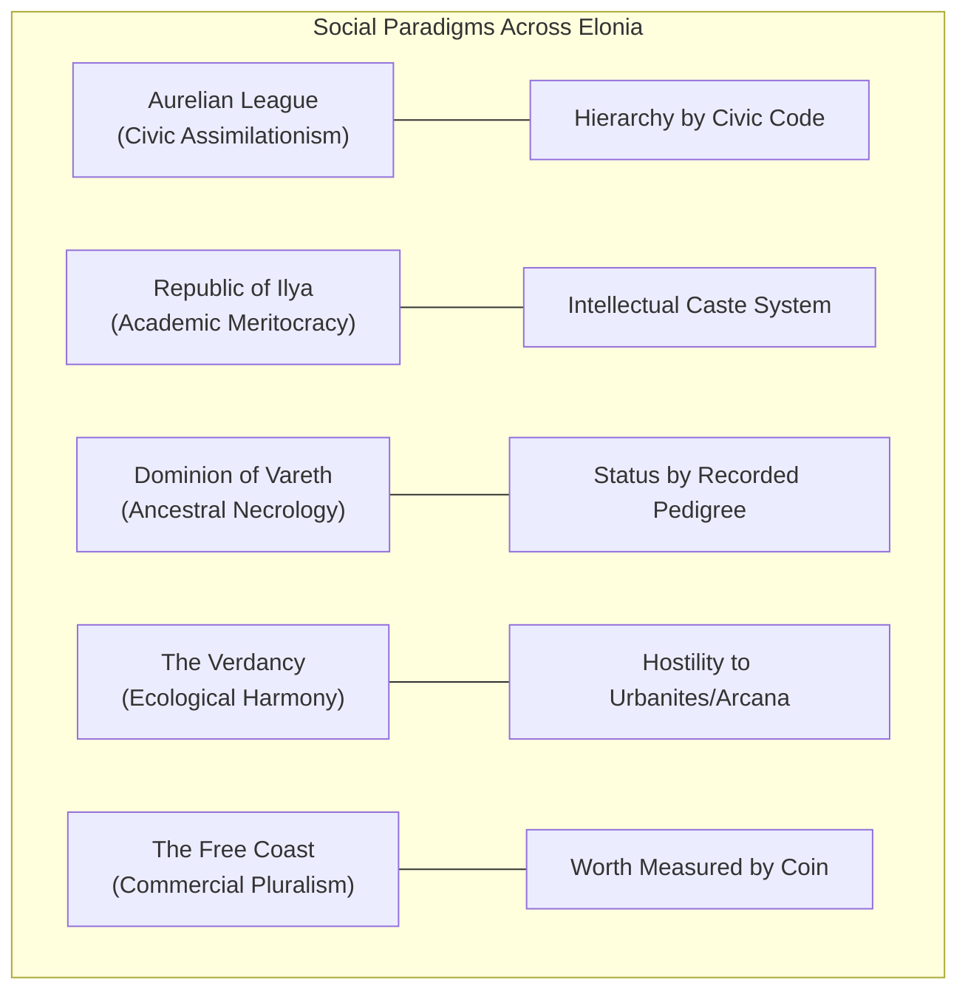

# Peoples and Social Structures: Lineage, Class, and Culture in Elonia

> *"The gods looked past the stone cities of the giants and the ocean-spanning wings of the dragons, and fixed their gaze upon mortals—fragile, short-lived, and capable of defying their own nature."*  
> **World Architecture • Lineages, Demographics, and Social Hierarchy**

---

## 1. The Peopling of Elonia `[ESTABLISHED CANON]`

The material world of Elonia was never homogeneous. Long before mortals built their first timber halls, the **Elder Peoples** wandered the primordial landscape:
- **The Elder Era:** Dragons claimed the storm-winds, giants raised cyclopean monoliths of unmortared stone, and ancient beastfolk nurtured wild sanctuaries under the open canopy.
- **The Coming of Mortals `[UNRESOLVED]`:** Humanity and kindred mortal lineages appeared without explanation in the ancient records. Fragile of flesh, lacking natural armor, and limited in lifespan, they were initially overshadowed by the elder titans.
- **The Wonder of the Celestine:** When the Nine awakened, it was not the dragons or giants who captivated them, but **mortals**. Unlike elder creatures bound to rigid natural instincts, mortals possessed **mutability**: they could love what was alien, wage war against their own blood, sacrifice themselves for abstract ideals, and contradict their own natures.

Under the **First Covenant**, the Celestine gathered mortals of diverse lineages—humans, dwarves, elves, halflings, and gnomes—into the Nine Cities, creating the cosmopolitan, poly-ethnic foundation of civilization.

---

## 2. The Lifespan Divide: The Generational Gap of the Silence

`[PLAYER-FACING]`
The most defining sociological rift in modern Elonia (c. 1,000 AS) is not merely physical lineage, but the **philosophical and psychological chasm of lifespan**:

```
┌────────────────────────────────────────────────────────────────────────┐
│                     THE LIFESPAN CHASM (c. 1,000 AS)                   │
├────────────────────┬────────────────────┬──────────────────────────────┤
│ Demographic Group  │ Average Lifespan   │ Perception of the Silence    │
├────────────────────┼────────────────────┼──────────────────────────────┤
│ Short-Lived        │ 60–90 Years        │ Ancient Myth: 30–40          │
│ (Humans, Orcs,     │                    │ generations removed. The     │
│ Halflings)         │                    │ gods are legends of song.    │
├────────────────────┼────────────────────┼──────────────────────────────┤
│ Medium-Lived       │ 120–200 Years      │ Historical Record: 5–8       │
│ (Dwarves, Gnomes)  │                    │ generations removed. Family  │
│                    │                    │ heirlooms hold real memory.  │
├────────────────────┼────────────────────┼──────────────────────────────┤
│ Long-Lived         │ 500–750 Years      │ Living Tragedy: 1–2          │
│ (Elves)            │                    │ generations removed. Elders  │
│                    │                    │ remember the day the sky wept│
└────────────────────┴────────────────────┴──────────────────────────────┘
```

### The Cultural Friction
- **The Human Perspective:** Humans view the Silence as ancient history. They rebuilt the world, forged the Five Powers, engineered modern arcana, and feel entitled to govern the continent through dynamic innovation. They often view elves and dwarves as paralyzed by nostalgic grief and archaic tradition.
- **The Elder Perspective (Elves & Dwarves):** For an elder elf or venerable dwarf in 1,000 AS, the Silence is not distant mythology. An elf’s grandmother personally walked the marble avenues of Solcaris or studied under Orinth in Ilyanor. Elder folk often view human institutions as reckless, amnesiac children playing with matchsticks around the ruins of an uncomprehended catastrophe.

---

## 3. Lineages of Elonia (5e Player Options)

---

### 3.1 Humans (The Restless Rebuilders)
- **Demographic Share:** ~55% of the continental population.
- **Cultural Standing:** Dominant demographic across the Aurelian League, Republic of Ilya, and Free Coast.
- **Social Character:** Driven, adaptable, politically ambitious, and impatient. Humans are the primary driving force behind both the ancient Ascensionists and the modern Ascendants. They dominate mercantile syndicates, mercenary charters, and secular universities.

---

### 3.2 Elves (The Echo-Bearers)
- **Demographic Share:** ~10% of the continental population.
- **Sub-Lineages & Social Roles:**
  - **River / High Elves (*The Ilyani*):** Heavily concentrated in the Republic of Ilya. They hold tenured chairs at the Grand Lyceum, serve as senior archivists, and obsessively research the arcane physics of the Veil. Many suffer from *The Melancholy*—a deep existential sorrow stemming from the absence of divine song.
  - **Canopy / Wood Elves (*The Elyndri*):** Inhabitants of The Verdancy. Fiercely protective of the ancient ironwood groves. They reject urban politics, living in communion with beastfolk and honoring seasonal equilibrium.

---

### 3.3 Dwarves (The Anvil-Keepers & Stone Scribes)
- **Demographic Share:** ~12% of the continental population.
- **Sub-Lineages & Social Roles:**
  - **The Iron-Bound (Thaeron's Legacy):** Mining and smithing clans of the western crags and Aurelian League. Revered as master armorers, siege engineers, and heavy infantry officers.
  - **The Grave-Masons (Varek's Legacy):** In the Dominion of Vareth, dwarves serve as the supreme architects of the necropolises. Their stone-cutting ensures that family vaults endure for millennia without crumbling.
- **Social Character:** Pragmatic, stoic, and deeply honorable. Dwarves place immense value on ancestral lineage, craftsmanship, and written contracts.

---

### 3.4 Halflings & Gnomes (The Hearth & The Clockwork)
- **Demographic Share:** ~11% of the continental population.
- **Halflings (The Riverfolk):** Prominent throughout the agrarian plains and riverways of the Republic of Ilya and Free Coast. They control river transport guilds, agricultural supply lines, and trade hospitality. They are practical survivalists who avoided the philosophical hubris of Avarr.
- **Gnomes (The Inquisitive):** Concentrated in New Ilya and Port Meridian. Renowned as chronometer-makers, cryptographers, and salvage artificers. Gnomish scholars are among the few who study the mechanical wreckage of the ancient Ascensionists without religious dread.

---

### 3.5 Dragonborn & Wyrm-Blooded (The Scales of the First Era)
- **Demographic Share:** ~4% of the continental population.
- **Cultural Standing:** Descendants of the dragons of the Elder Era. Primarily settled in autonomous coastal citadels and high mountain keeps overlooking the Meridian Gulf.
- **Social Character:** Fiercely clan-centric and steeped in martial dignity. They view the Celestine as latecomers who disrupted the natural order, and treat modern human politics with aloof amusement. Valued across Elonia as elite marine shock troops and pyromantic alchemists.

---

### 3.6 The Veil-Touched: Tieflings & Aasimar
- **Demographic Share:** ~3% of the continental population (Extremely Rare).
- **Tieflings (*The Ash-Born / Fracture-Touched*):**
  - `[PLAYER-FACING]` In Elonia, tieflings are **not** fiendish offspring of hells. They are individuals born near active soulway fractures, ancient Engine ruin-zones, or in the wake of catastrophic arcane misfires. Their horns, tail, and strange eyes are physical manifestations of warped ambient ether.
  - **Social Treatment:** Feared in the Aurelian League as omens of spiritual corruption; analyzed in New Ilya as clinical curiosities; pitied in Vareth as having "frayed soul-threads." Along the Free Coast, they are embraced as lucky navigators and daring salvagers.
- **Aasimar (*The Dawn-Echoes*):**
  - Born with rare, lingering harmonic resonance to the ancient Celestine. They do not receive divine visions, but emit a subtle radiant aura.
  - **Social Treatment:** Revered by the Keepers of Dawn as holy prodigies, but deeply alienated in daily life. `[DM-ONLY]` Their radiant presence inadvertently triggers violent resonance spikes when near Seraphel's soul-siphons.

---

### 3.7 Beastfolk, Orcs, and Frontier Lineages
- **Demographic Share:** ~5% of the continental population.
- **Beastfolk (Tabaxi, Shifters, Firbolgs, Tortles):** Predominant in The Verdancy and the pirate flotillas of the Free Coast. They emphasize ancestral instinct, ecological harmony, and maritime freedom.
- **Half-Orcs & Orcs (*The Crucible-Born*):** Celebrated in frontier borderlands for their physical fortitude and indomitable will, embodying Thaeron's teaching that struggle creates dignity. Common in legionary shock units and deep mining colonies.

---

## 4. Treatment of Peoples Across the Five Great Powers



---

### 4.1 The Aurelian League: Civic Assimilationism
- **The Golden Code:** The League claims absolute equality under the law for all citizens, regardless of lineage—**provided they assimilate completely**.
- **The Reality:** The military senate and grand magistracies are heavily dominated by human aristocratic patricians and conservative dwarven forge-masters.
- **Prejudices:** 
  - Wandering peoples (beastfolk, half-orcs, nomad elves) are subjected to heavy vagrancy taxes and mandatory labor service.
  - Tieflings are legally mandated to register with the *Prefecture of Spiritual Purity* and cannot hold public magistracies.

---

### 4.2 The Republic of Ilya: Academic Meritocracy & Intellectual Elitism
- **The Thesis Caste:** In New Ilya, legal rights and social privileges correspond to academic degree: *Chancellors*, *Deans*, *Magisters*, *Scholars*, and *Unmatriculated*.
- **The Reality:** Generational wealth controls admission to the Grand Lyceum. Long-lived high elves and wealthy human patrician dynasties hold near-monopolies over senior professorships.
- **Prejudices:** 
  - Non-academic populations (dockworkers, halfling agriculturalists, beastfolk mechanics) are treated as intellectual inferiors.
  - Tieflings and anomalous lineages are frequently pressured into signing "arcane research consent waivers" in exchange for urban residency permits.

---

### 4.3 The Dominion of Vareth: The Politics of Ancestry
- **The Great Tablet:** A citizen's legal standing in Khar Vareth is determined by how many centuries their family bloodline has been recorded on the monumental tablets of the Necropolis.
- **The Reality:** Ancient dwarven stone-cutter clans and venerable human mortuary dynasties sit at the apex of society.
- **Prejudices:** 
  - Immigrants, wanderers, and orphans whose lineages are unrecorded are known as **The Nameless**. While not physically harmed, they are barred from ancestral vaults and treated with pity and quiet spiritual condescension, as people who will "dissolve into forgotten ash upon death."

---

### 4.4 The Verdancy: Ecological Harmony & Technophobia
- **The Circle Fellowship:** Lineage, species, and race are irrelevant within the canopy. Humans, wood elves, firbolgs, and beastfolk share communal hearths, working under the guidance of regional Grovewardens.
- **The Prejudice (The Iron Taboo):** Prejudice in The Verdancy is cultural and technological. Anyone carrying refined clockwork, brass arcane apparatus, or municipal law scrolls is labeled an **"Iron-Mortal"** and treated with intense hostility, subject to immediate expulsion or ritual cleansing.

---

### 4.5 The Free Coast: Pure Commercial Pluralism
- **The Coin Standard:** Port Meridian is the most racially integrated metropolis in Elonia. A dragonborn sea-captain, an ash-touched tiefling smuggler, an elven cartographer, and a human merchant drink in the same taverns without comment.
- **The Reality:** Economic ruthlessness replaces racial prejudice. If you cannot pay your docking fees or debts, the Admiralty courts will auction your labor contract to deep salvage syndicates, regardless of who your ancestors were.

---

## 5. The Racial Dimension of the Soul Crisis `[DM-ONLY]`

The failing soulways do not affect all lineages equally:

1. **Short-Lived Humans:** Account for 80% of the raw spiritual volume trapped in the Bleak Path due to rapid generational turnover. Their unpassed spirits form the screaming spectral tides in the lower catacombs.
2. **Elder Elves:** Suffer **Spectral Resonances**. When an ancient elf dies, their soul carries centuries of complex memories; when trapped in the damaged soulways, their stasis radiates intense psychic feedback, causing living elven kin to experience night terrors and waking hallucinations.
3. **The Veil-Touched as Fuel:** Lord Seraphel’s researchers have discovered that tieflings and aasimar possess souls with unusual metaphysical elasticity. Consequently, Seraphel’s covert retrieval agents prioritize capturing and siphoning veil-touched individuals, using them as high-density spiritual catalysts for the Apotheosis Dais.
