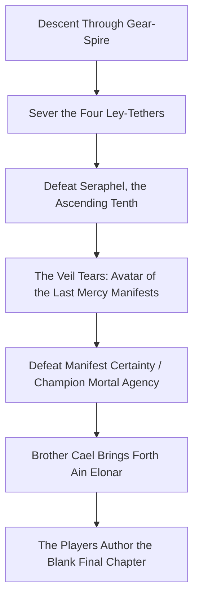

# Location Profile: The Engine Deep & The Open Veil

> *"Miles beneath the earth, the machine that broke heaven still hums. Brass gears the size of cathedrals turn in the dark, bathed in the screaming light of stolen souls."*  
> **Campaign Climax: Act VI (Levels 18–20) • The Abyssal Bedrock**

---

## 1. Site Overview `[DM-ONLY]`

- **Classification:** Ancient Titan-Scale Subterranean Laboratory & Metaphysical Tear.
- **Location:** Situated miles beneath the central geological bedrock of Elonia, directly accessible via the subterranean Star Roads or abyssal elevator conduits from the lowest mines.
- **Builders:** The ancient mortal **Ascensionists** (c. 1,000 BS); recently refurbished and weaponized by **Lord Seraphel of House Vane**.
- **Tone & Aesthetic:** Cyclopean, terrifying, industrialized, and mythic. A cavern so colossal it possesses its own internal weather—static lightning storm-clouds and acid rain. Massive brass flywheels, miles of humming copper pipes, pneumatic pistons the width of towers, and glowing glass tubes carrying liquidized soul-light illuminate the darkness with sickly violet and radiant gold.

```
                           THE STAR ROAD TRANSIT SHAFT
                                        │
                                (Vertical Plunge)
                                        ▼
                         [1. THE GEAR-SPIRE OF THE FIRST]
                          (Cyclopean Clockwork Scaffold)
                                        │
                         [2. THE FOUR LEY-TETHERS]
                          (Regional Stabilization Conduits)
                                        │
                         [3. THE SOUL CRUCIBLE]
                          (Vortex of Stolen Spirits)
                                        │
                         [4. THE APOTHEOSIS DAIS]
                          (Seraphel's Transmutation Throne)
                                        │
                         [5. THE OPEN VEIL]
                          (Cosmic Tear ── Avatar of the Last Mercy ── Blank Altar)
```

---

## 2. Keyed Climactic Chambers

### 1. The Gear-Spire of the First Ascendants
- **Description:** A vertical descent through three miles of rotating brass cogwheels, swinging balance-weights, and pressurized steam-valves. 
- **Environmental Hazard:** Inverted Gravity Zones and Temporal Static. Characters must make DC 18 Dexterity (Acrobatics) checks to navigate the shifting platforms. Time flickers here: a spell cast may take effect one round early or one round late.
- **Guardians:** *Ascension Automatons*—colossal iron and brass golems infused with ancient elemental spirits, programmed to destroy anything that does not present House Vane clearance codes.

### 2. The Four Ley-Tethers
- **Description:** Four massive, pulsating conduits of translucent spirit-glass that enter the cavern from the cardinal directions, channeling harvested souls from across Elonia:
  - *The Northern Tether* (New Ilya Siphon)
  - *The Southern Tether* (Khar Vareth Siphon)
  - *The Eastern Tether* (Solcaris Pylon Siphon)
  - *The Western Tether* (Meridian Coastal Siphon)
- **Tactical Objective:** To weaken Seraphel prior to the final duel, the party must sever or unseat these four conduits. Each conduit has AC 19, 150 HP, and retaliates with a *Chain Lightning* pulse (DC 18 Dex save, 10d8 lightning) when struck.

### 3. The Soul Crucible
- **Description:** A sphere of reinforced abyssal adamantine five hundred feet across. Inside churns a howling, blinding maelstrom of over 500,000 stolen mortal souls held in high-pressure stasis.
- **The Psychic Storm:** Any creature coming within 100 feet of the Crucible without psychic shielding must succeed on a DC 18 Wisdom saving throw or take 4d10 psychic damage from the deafening chorus of unpassed memories.

### 4. The Apotheosis Dais
- **Description:** A stepped pyramid of black obsidian standing in the center of the cavern, bathed in a vertical cataract of raw celestial radiance. Atop the pyramid sits the *Apotheosis Throne*, surrounded by twelve floating platinum rings that focus the energy of the Crucible directly into a single mortal vessel.
- **The Showdown with Seraphel:** Here the party confronts **Seraphel, the Ascending Tenth**. In his half-transformed divine state, Seraphel commands 9th-level arcana, legendary actions, and the ability to absorb damage by expending trapped souls.

### 5. The Open Veil & The Threshold of Possibility
- **Description:** Behind the Apotheosis Throne, the fabric of the material universe has torn wide open. A colossal vertical fissure of pearlescent, liquid light exposes the boundary beyond the cosmos.
- **The Manifestation:** When Seraphel falls and his soul-siphons shatter, the sudden release of cosmic pressure triggers the manifestation of the **Avatar of the Last Mercy**.
- **The Final Pedestal:** At the edge of the tear stands a plain, weathered stone lectern. Upon it rests the living mythic codex **Ain Elonar**, held open to the final, completely blank chapter: *"Of What Comes Next."*

---

## 3. Environmental & Metaphysical Lair Rules

Within the Engine Deep and Open Veil, reality bends to the following regional effects:

1. **The Weight of Unspoken Words:** Divine and arcane magic interact violently. Whenever a 6th-level or higher spell is cast, roll a d20. On a 1, a wild magic surge of concentrated soul-light detonates, dealing 6d6 radiant damage to all creatures within 30 feet.
2. **Resonant Mortality:** Healing magic is intensified by the proximity of the Soulways. Spells that restore hit points heal the maximum possible amount, but the recipient hears the ghostly whispers of the unpassed dead for 1 round.
3. **The Unraveling Law:** Spells that manipulate time or teleportation (*Misty Step*, *Dimension Door*, *Time Stop*) suffer a 25% failure chance due to the twisted spatial geometry of the Engine.

---

## 4. The Climax Progression & The Choice of Ages



1. **Stage 1 — The Mortal Duel:** Defeat Seraphel, demonstrating that brilliant intellect and sincere conviction do not justify tyrannical authority.
2. **Stage 2 — The Cosmic Test:** Overcome the Avatar of the Last Mercy, demonstrating that humanity chooses the pain and triumph of freedom over the gilded cage of forced safety.
3. **Stage 3 — The Inscription:** Standing before the Open Veil, with Brother Cael (Orinth) at their side, the party chooses Elonia's permanent metaphysical future and speaks the words that close the codex.
