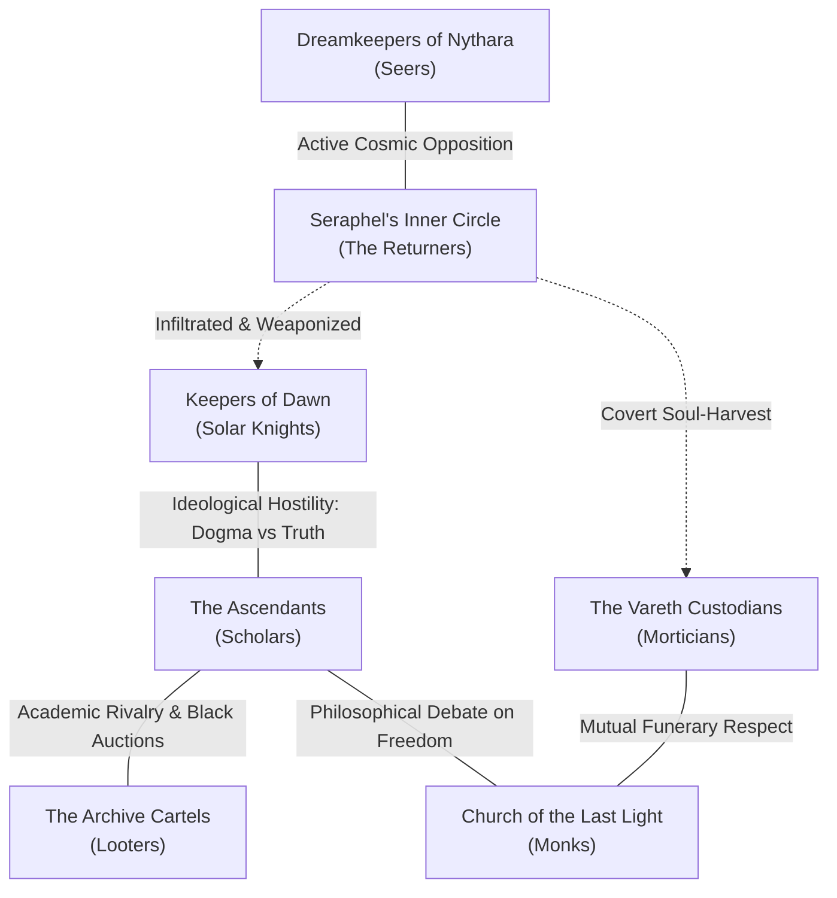

# 05_FACTIONS

**Purpose:** Master dossiers, organizational structures, hidden agendas, NPC archetypes, and reputation mechanics for the seven major political, religious, scholarly, and criminal factions in *Ashes of Elonia*.

---

## Directory Contents

Both Markdown (`.md`) and compiled Word (`.docx`) editions are maintained in this directory:

- [the_ascendants.md](file:///home/jackm/Documents/Ashes_Of_Elonia/05_FACTIONS/the_ascendants.md) / `the_ascendants.docx` — **The Scholarly Movement:** The pluralistic modern archaeological fellowship seeking recovered truth ("Ex Cineribus Veritas"). Enforces the rule that ordinary Ascendants are sincere humanist researchers, not an evil cult.
- [the_church_of_the_last_light.md](file:///home/jackm/Documents/Ashes_Of_Elonia/05_FACTIONS/the_church_of_the_last_light.md) / `the_church_of_the_last_light.docx` — **Guardians of Choice:** The ascetic monastic order rooted in Brother Cael’s vigil at Lantern Chapel. Deliberately poor and politically weak to preserve moral freedom.
- [the_keepers_of_dawn.md](file:///home/jackm/Documents/Ashes_Of_Elonia/05_FACTIONS/the_keepers_of_dawn.md) / `the_keepers_of_dawn.docx` — **The Solar Orthodoxy:** The knightly chivalric order of Solcaris Nova dedicated to Aurelion’s solar memory; provides sincere, honorable reasons to desire divine return while struggling with dogmatic rigidity.
- [the_vareth_custodians.md](file:///home/jackm/Documents/Ashes_Of_Elonia/05_FACTIONS/the_vareth_custodians.md) / `the_vareth_custodians.docx` — **The Scribes of Memory:** The necrological mortuary guild of Khar Vareth preserving the names of the dead; the first institution to statistically discover the Soul Crisis.
- [the_archive_cartels.md](file:///home/jackm/Documents/Ashes_Of_Elonia/05_FACTIONS/the_archive_cartels.md) / `the_archive_cartels.docx` — **The Antiquities Underworld:** The cutthroat black-market syndicates and salvage breakers of Port Meridian who treat ancient history as pure commercial inventory.
- [the_dreamkeepers_of_nythara.md](file:///home/jackm/Documents/Ashes_Of_Elonia/05_FACTIONS/the_dreamkeepers_of_nythara.md) / `the_dreamkeepers_of_nythara.docx` — **The Stargazers of Selyra:** The blindfolded mountain seers of Nythara preserving possibility against deterministic certainty, guarding the Star Road keys.
- [seraphels_inner_circle.md](file:///home/jackm/Documents/Ashes_Of_Elonia/05_FACTIONS/seraphels_inner_circle.md) / `seraphels_inner_circle.docx` — **The Returners Conspiracy:** The clandestine network beneath Lord Seraphel weaponizing public religious nostalgia to harvest souls for his apotheosis as the Tenth Celestine.

---

## Cross-Faction Dynamics Matrix

---

## Table Running Rules for Faction Standing

Track reputation across a scale of **-3 (Hunted Kill-on-Sight)** to **+3 (Exalted Champion)** in `10_LIVE_CAMPAIGN_STATE/`:
- **Standing +1 (Friendly):** Faction provides lodging, mundane supplies, and local information.
- **Standing +2 (Allied):** Access to private libraries, restricted armaments, and legal protection.
- **Standing +3 (Exalted):** Access to highest-tier artifacts (relic keys, divine seals), personal retinues, and safe harbor against state warrants.
- **Standing -2 (Hostile):** Interrogations, commercial boycotts, and surveillance by faction agents.
- **Standing -3 (Hunted):** Active kill-teams and municipal bounties placed upon party members.
